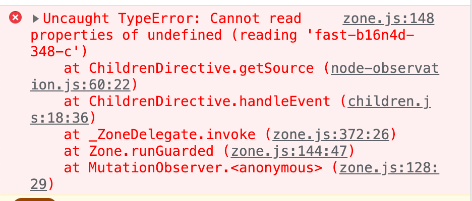
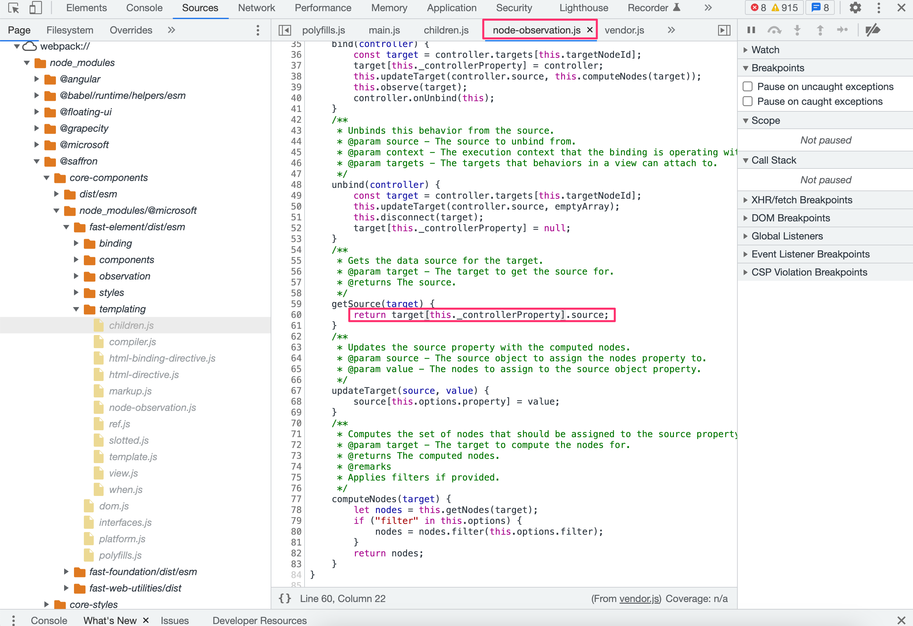
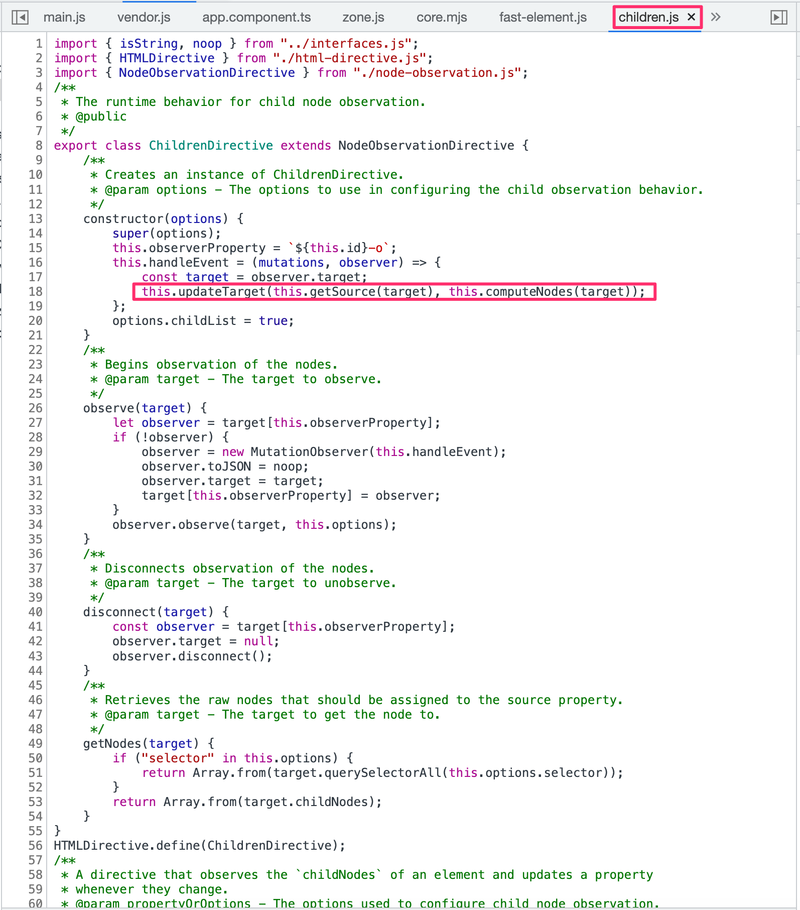
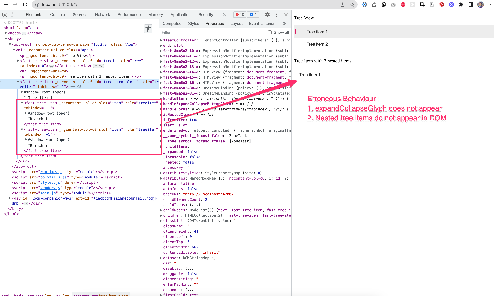
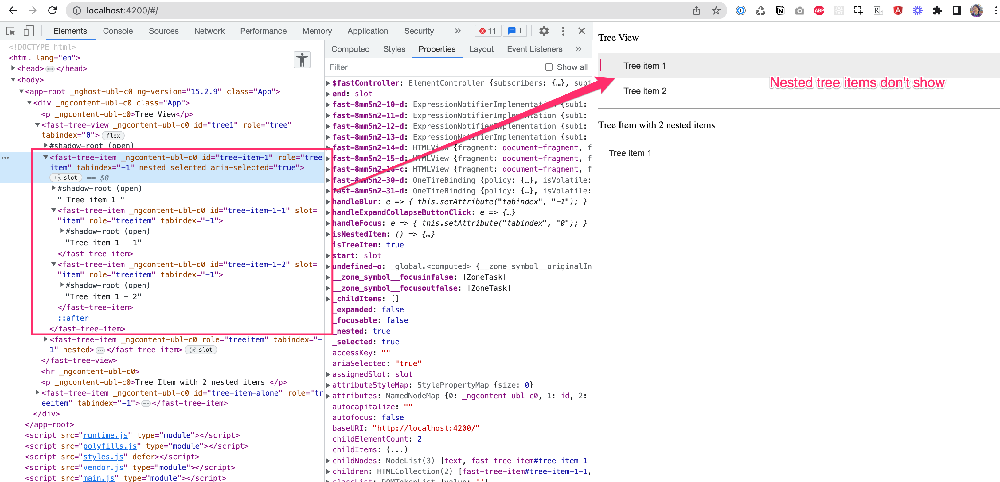

# AngularFast14

This project was generated with [Angular CLI](https://github.com/angular/angular-cli) version 14.
# About

This is a reproduction of an issue involving use of the `ChildrenDirective` in FASTTreeItem and FASTTreeView leading to failure to render nested tree items in Angular.

Console errors:

```
Uncaught TypeError: Cannot read properties of undefined (reading 'fast-fmoaic-304-c')
    at ChildrenDirective.getSource (node-observation.js:[60:22](https://github.com/microsoft/fast/blob/master/packages/web-components/fast-element/src/templating/node-observation.ts#L81))
    at ChildrenDirective.handleEvent (children.js:[18:36](https://github.com/microsoft/fast/blob/master/packages/web-components/fast-element/src/templating/children.ts#L100))
    at _ZoneDelegate.invoke (zone.js:372:26)
    at Zone.runGuarded (zone.js:144:47)
    at MutationObserver.<anonymous> (zone.js:128:29)
```

This reproduction uses Angular 15 and the following FAST packages:
```
"@microsoft/fast-element": "2.0.0-beta.23",
"@microsoft/fast-foundation": "3.0.0-alpha.27",
"@microsoft/fast-web-utilities": "6.0.0",
```











## Development server

Run `ng serve` for a dev server. Navigate to `http://localhost:4200/`. The application will automatically reload if you change any of the source files.

## Code scaffolding

Run `ng generate component component-name` to generate a new component. You can also use `ng generate directive|pipe|service|class|guard|interface|enum|module`.

## Build

Run `ng build` to build the project. The build artifacts will be stored in the `dist/` directory.

## Running unit tests

Run `ng test` to execute the unit tests via [Karma](https://karma-runner.github.io).

## Running end-to-end tests

Run `ng e2e` to execute the end-to-end tests via a platform of your choice. To use this command, you need to first add a package that implements end-to-end testing capabilities.

## Further help

To get more help on the Angular CLI use `ng help` or go check out the [Angular CLI Overview and Command Reference](https://angular.io/cli) page.
